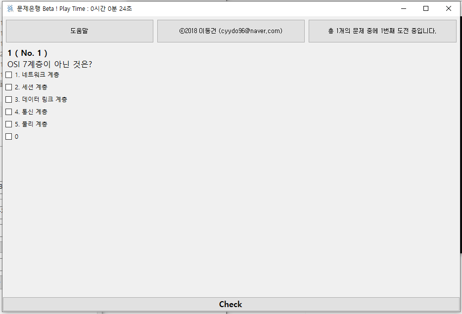
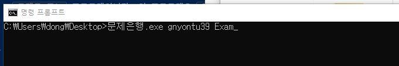
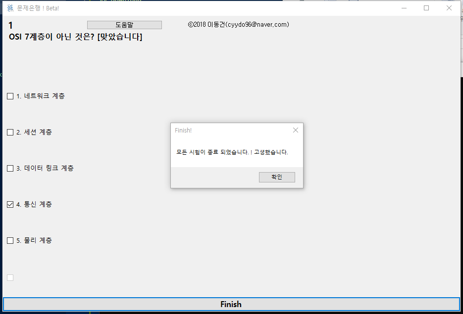

# Question-Bank-Student

Question Bank Student :: 문제은행에서 문제를 푸는 프로그램입니다.



## Download

- 0.0.3 (`2018.01.18.1800`)
  - [Windows x86 zip file](./build/Question-Bank-Student_x86_0.0.3.zip?raw=true)

## Old Version

- [0.0.2 (`2018.01.18.1254`)](https://github.com/Sotaneum/Question-Bank-Student/tree/4ef12feed7f07255cb78f052fe5c15469ab7a2f4)
- [0.0.1 (`2018.01.18.1240`)](https://github.com/Sotaneum/Question-Bank-Student/tree/3d01209d149f4ea49a86476f4ff32a007bff4023)

## Info

- `문제를 푸는` 프로그램입니다. 이 프로그램은 `문제은행(Question-Bank)` 프로젝트의 일부입니다.
- `Question-Bank`프로젝트의 [`Question-Bank-Teacher`](https://github.com/Sotaneum/Question-Bank-Teacher)와 호환됩니다.
- `프로그램을 실행`하는 방법은 다음과 같습니다.
  - Command 창을 켜서 아래와 같이 입력합니다.

    

    ```bash
    '  파일 명      작성자  문제집 이름'
    > 문제은행.exe gnyontu39 Exam_
    ```

  - 아래와 같이 문제가 표시가 되며 답을 선택 후 `Check/Finish 버튼`을 누르면 정답여부가 나옵니다.

    

  - 문제가 종료가 되면 아래와 같이 `정보`를 표시합니다.

    

## What did you learn

- VB.NET 기반 언어를 `입출력`에 대해 공부할 수 있었습니다.
- 문제가 어떻게 생겼는 지에 대해 판단하고 어떻게 하면 `맞았다/틀렸다`를 구분할 수 있는지 알 수 고민하는 시간을 가졌습니다.
- `문자열 처리`에 대해 공부할 수 있었습니다.

## Finally

- CCNA, OCP, OCJP를 공부할 때 문제집을 사용하기 보다 문제은행을 만들면 어떨까에 대한 생각에서 시작했습니다.
- 어떻게 하면 쉽게 문제를 등록할 수 있을지에 대해 고민했습니다.
- 사진이 필요한 문제에 대해서는 어떻게 처리할 지 고민을 했습니다.

## Modify Content

- 2018.01.18.1800
  1. 랜덤코드 변경
  2. 문제 고유번호도 화면에 출력하도록 설정

- 2018.01.18.1254
  1. 기타 마이너 패치

- 2018.01.18.1240
  1. 랜덤문제를 수집시, 최대 개수에 있는 리스트에서만 표시되던 것을 수정
  2. \n를 인식하여 줄바꿈 기능 추가
  3. 종료시 종료하기 전까지 했던 문제 통계를 표시
  4. 기타 마이너 패치

## Copyright

- 비상업적 용도로 사용 가능하며 링크를 반드시 포함해주세요.
- 문제가 되는 내용이 있다면 언제든지 [`issue`](https://github.com/Sotaneum/Question-Bank-Student/issues/new), [`Pull requests`](https://github.com/Sotaneum/Question-Bank-Student/compare) 부탁드립니다.
